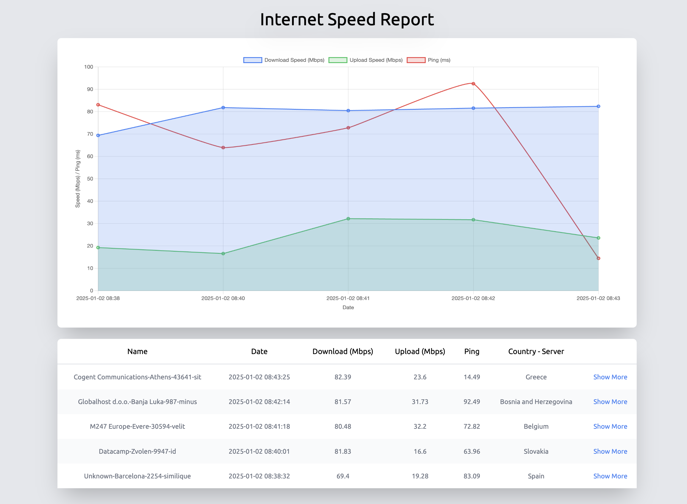
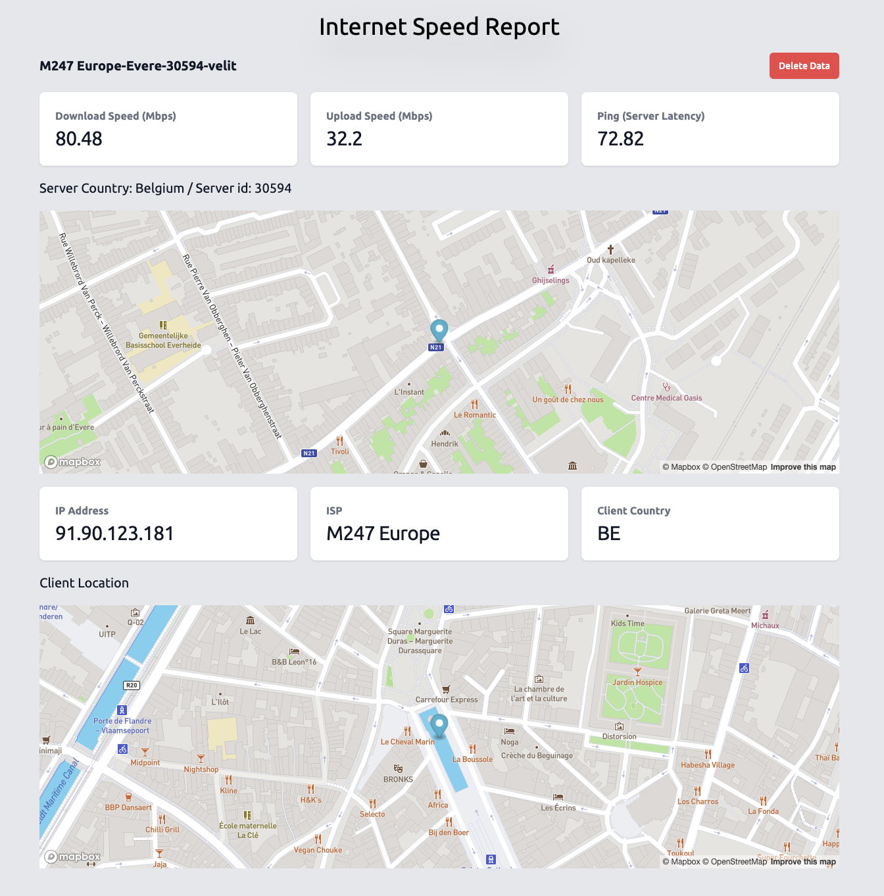

# Internet Speed Report
An open source tool to get a more in-depth look at your internet data.
It utilises [Speedtest CLI](https://github.com/sivel/speedtest-cli) and depicts your data in tables, graphs and charts.

This is a Laravel updated version to its predecessor [WebSpeedReport](https://github.com/bak-george/WebSpeedReport).




## Current Features
- Graph and table with each point directing to the corresponding data and.
- A show route for each data that dives deeper into the data.
- Button to execute the speedtest commands through the UI.

## Currently working on
- API
- Setting a cron from the UI.

## How to Install
- Download the free version of [Herd](https://herd.laravel.com) and clone the repository within your Herd directory.
- Don't forget to run ```composer install``` once you cd inside your project and ```npm run dev``` to build the UI assets.

## How to Use
- Install [Speedtest CLI](https://github.com/sivel/speedtest-cli)
- cd into the project and run ```php artisan speedtest:run```.
- Click the "Run Speed Test" in the Homepage (see below)

## How to get all the features (App Setup)
### Pull regularly
I am working on this on a daily basis, so don't forget to ```git pull``` once in a while to get new stuff.

### "Run Speed Test" in the Homepage
#### Add the following into your php.ini
```
max_execution_time = 120
max_input_time = 60
default_socket_timeout = 6
```
In Herd on MacOS php.ini is located in the following path:
 ```
 /Users/your_username/Library/Application Support/Herd/config/php/the_php_version_you_use/php.ini
 ```
#### Restart Herd
```
herd restart
```
#### Add the speedtest path your .ENV and edit timeout
```
PHP_MAX_EXECUTION_TIME=120
SPEEDTEST_PATH=""
```
To find your own path of speedtest run the following:
```
which speedtest
```
### To see the Map data
Add your Free Mapbox API Key from [mapbox](https://www.mapbox.com/)
```
MAPBOX_API_KEY="Your mapbox API key"
```
