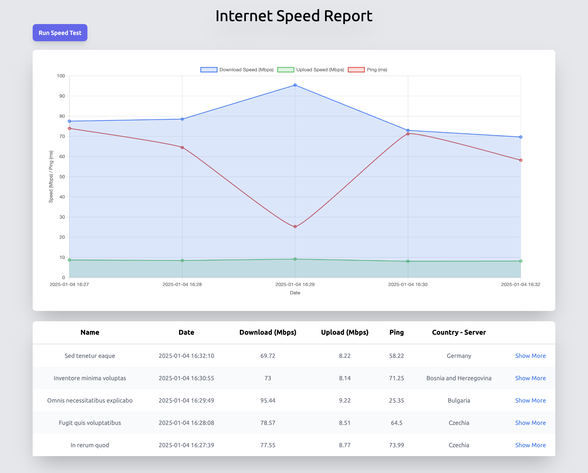

# Internet Speed Report
An open source tool to get a more in-depth look at your internet data.
It utilises [Speedtest CLI](https://github.com/sivel/speedtest-cli) and depicts your data in tables, graphs and charts.

This is a Laravel updated version to its predecessor [WebSpeedReport](https://github.com/bak-george/WebSpeedReport).




## Current Features
- Graph and table with each point directing to the corresponding data and.
- A show route for each data that dives deeper into the data.

## Currently working on
- Button to execute the speedtest commands through the UI.
- Logs in the UI.
- Setting a cron from the UI.

## How to Install
- Download the free version of [Herd](https://herd.laravel.com) and clone the repository within your Herd directory.
- Don't forget to run ```composer install``` once you cd inside your project and ```npm run dev``` to build the UI assets.

## How to Use
cd into the project and run ```php artisan speedtest:run```.

## How to get the most out of this
I am working on this on a daily basis, so don't forge to ```git pull``` once in a while to get new stuff.
